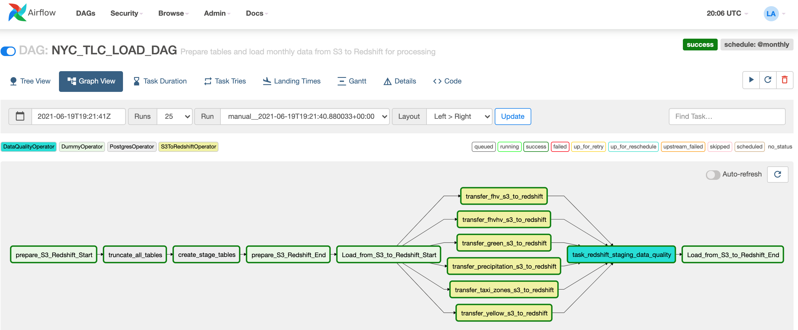
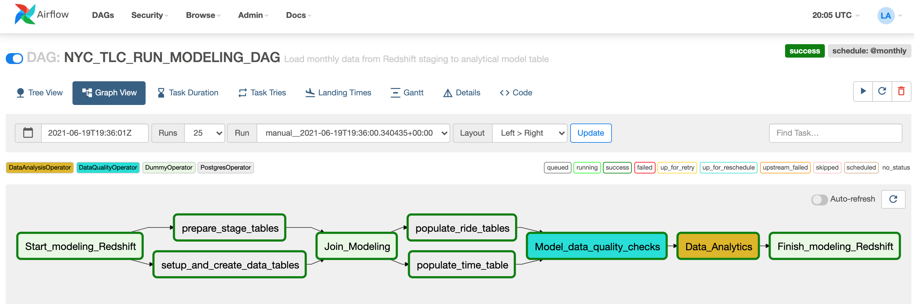

# UDACITY CAPSTONE PROJECT : DATA ENGINEER NANO-DEGREE

## OBJECTIVE

The purpose of this project is to build an ETL pipeline that will be able to provide information to data analysts, and researchers about taxi rides and how it can be affected by weather, and to provide a database mechanism that enables queries, joins and analysis in a large volume of trip rides, hapenned in December of 2020. 

The project extracts information from Ney York city taxi and limousine comission (TLC) Trip record dataset offered by AWS, and from NOAA National Oceanic and Atmospheric Administration the weather information.

The datasets are ingested and transformed to an appropriate schema for analytics purposes. This project uses Apache Airflow to automate and orchestrate ETL and data quality tasks on new data as it becomes available on a monthly basis.

AWS Redshift is used because it is fast, with high performance and is horizontally scalable with massive storage capacity. For reference, it takes only 3 minutes in order to move the 15 million rows of the yellow rides from S3 to Redshift.

## PROJECT 

The New York City Taxi and Limousine Commission [(TLC)](https://www1.nyc.gov/site/tlc/about/tlc-trip-record-data.page), created in 1971, is the agency responsible for licensing and regulating New York City's Medallion (Yellow) taxi cabs, for-hire vehicles (community-based liveries, black cars and luxury limousines), commuter vans, and paratransit vehicles. 
The TLC collects trip record information for each taxi and for-hire vehicle trip completed by our licensed drivers and vehicles. They receive taxi trip data from the technology service providers (TSPs) that provide electronic metering in each cab, and FHV trip data from the app, community livery, black car, or luxury limousine company, or base, who dispatched the trip. Over 200,000 TLC licensees complete approximately 1,000,000 trips each day.

Each trip is stored into the dataset as a single row. There are five major data sources that are used, dating from 2009 until present. To see more information, please check this [user guide](https://www1.nyc.gov/assets/tlc/downloads/pdf/trip_record_user_guide.pdf).

## DATA SOURCES

[NYC-TLC](https://registry.opendata.aws/nyc-tlc-trip-records-pds/)

[NOAA Weather Data](https://www.ncdc.noaa.gov/cdo-web/)

### Yellow Taxicabs
Yellow taxicabs are the iconic, yellow vehicles that have the right to pick up street-hailing passengers anywhere in New York City. Taxis can also be dispatched by TLC-licensed E-Hail companies. By law, there are 13,587 taxis in New York City and each taxi must have a medallion affixed to it. Vehicles can be owned by drivers or leased to them by licensed garages. Grant funding is available for wheelchair accessible taxis. The [yellow taxi data dictionary](https://data.cityofnewyork.us/api/views/biws-g3hs/files/eb3ccc47-317f-4b2a-8f49-5a684b0b1ecc?download=true&filename=data_dictionary_trip_records_yellow.pdf) can be downloaded for reference.

### For-Hire Vehicles (FHVs)
For-Hire Vehicles provide pre-arranged service anywhere in New York City and are dispatched by TLC-licensed FHV bases. For-Hire Vehicles must be affiliated with a single FHV base, but may accept dispatches from any base. Currently, the TLC will only accept a new FHV application if the vehicle is wheelchair accessible or is electric, or if the driver has a lease-to-own contract. If you do not have a current FHV license, click “Get a For-Hire Vehicle License” to learn if you are eligible to apply for a new FHV vehicle license. The [FHV data dictionary](https://data.cityofnewyork.us/api/views/am94-epxh/files/0341cc01-520a-49eb-bc3c-94f6c35c6355?download=true&filename=data_dictionary_trip_records_fhv.pdf) and [FHVHV data dictionary](https://www1.nyc.gov/assets/tlc/downloads/pdf/data_dictionary_trip_records_hvfhs.pdf) can be downloaded for reference.

### Green Cabs
Green cabs or Street-Hail Liveries (SHLs) are For-Hire Vehicles that are permitted to accept street-hails. In exchange, Street-Hail Liveries may not operate in the Hail Exclusionary Zone, south of West 110th St and East 96th St. The Street-Hail Livery License is a license that is attached to a For-Hire Vehicle License. Grant funding is available for new wheelchair accessible SHLs. The [green taxi data dictionary](https://data.cityofnewyork.us/api/views/hvrh-b6nb/files/65544d38-ab44-4187-a789-5701b114a754?download=true&filename=data_dictionary_trip_records_green.pdf) can be downloaded for reference.

### Commuter Vans
Commuter vans are vehicles that transport between 9 and 20 passengers in preapproved zones for a flat rate. Commuter vans are operated by Commuter Van Authorities.

### Paratransit Vehicles
Paratransit vehicles provide non-emergency transportation for passengers with disabilities. Paratransit vehicles are dispatched by paratransit bases.

## DATA MODEL

## DATA INVESTIGATION

Due to the large data size, I'm using only the data from December 2020. Data for each taxi type is stored in a CSV file for each month in the 'trip data' folder. Information about the different taxi zones and borough maps are located in the 'misc' folder. A duplicate taxi zones table was uploaded to a public S3 bucket in JSON format with a representative manifest file for reading it into Redshift.
A dataset containing weather information since 2015 and onward from a weather station located at the Central Park stored into a S3 folder as a JSON file. 
All that was done to meet the project specifications of multiple data source formats.

The data required for this project is of very high quality, however minor cleaning needed to be done while reading data from S3 to Redshift. The trip data needed to be modified during the load step by including the following code in the query: delimiter ',' IGNOREBLANKLINES REMOVEQUOTES EMPTYASNULL. Secondly, a manifest file needed to be created to mediate loading of the taxi zones data and a second manifest file was needed to mediate the weather loading.

## STEPS NECESSARY BY THE DAGs:

- Staging tables are created using the PostgresOperator
- A configured S3ToRedshiftOperator is used to move taxi zone data (JSON), weather precipitation data (JSON), and ride data (CSV) from S3 to redshift.
- The first DataQualityOperator is used to validate that data had been populated into the staging tables.
- The PostgresOperator is again used to create the final data model, create the dimensions and fact tables,  and edit the staging tables structure in preparation for merging.
- The PostgresOperator is used to copy data from the staging tables to the taxi_rides (fact) table, create the precipitation and time dimensions table.
- The second DataQualityOperator is used to check that the final tables had been populated as expected.
- The DataAnalysisOperator is used to run simple analytical queries on the data model to validate the model.
- The data model allows ad hoc queries regarding the number and total income of each borough for taxis and is joined to avoid having to join the green and yellow taxi data at run time and weather. 
- And finally, the model also included staging tables for fhv and fhvhv rides which can be queried to determine the number of rides per ride type per borough.

## DAG WORKFLOW

### DAG #1 : NYC_TLC_UPLOAD_FILES_DAG

### DAG #2 : NYC_TLC_LOAD_DAG

### DAG #3 : NYC_TLC_RUN_MODELING_DAG

## HOW TO RUN THIS PROJECT

1. Clone this project from [Github](https://github.com/LeoArruda/UdacityCapstoneDataEngineer)
2. Create an user on AWS
3. Create an IAM role on AWS
    * Attach the *AmazonS3ReadOnlyAccess* policy.
4. Create a security group in the Amazon EC2 console with the following values:
    * Type: *Custom TCP Rule*
    * Protocol: *TCP*
    * Port Range: *5439*
    * Source: select *Custom IP*, then type *0.0.0.0/0*
5. Launch a redshift cluster using the *IAM role* and *security group* you defined previously.
    * For this project, the recommended configuration is *dc2.large* cluster.
    * CPU: 8 EC2 compute units (2 virtual cores) per node
    * Memory: 15.25 GiB per node
    * Storage: 160-320 GB SSD per node
    * Cluster type: Single node   
6. Create an *IAM user* to allow you to issue commands to both Redshift and S3
    * Assign *programmatic access* with the following policies:
        * *AmazonRedshiftFullAccess*
        * *AmazonS3ReadOnlyAccess*
    * **Save your credentials** because it is only accessible at creation.
7. Install Apache-Airflow and dependencies (requirements.txt)
    * Run: pip install -r requirements.txt
    * Run airflow:
        * airflow init
        * To start, I created the bash script: **start.sh**
        * If you prefer to run manually:
            * airflow scheduler
            * airflow webserver
    * On Airflow console, you must create the following *connections*:
        * *redshift*: a postgres connection with your cluster information, user and password.
        * *aws_credentials*: an Amazon connection with your IAM user key.
8. An S3 bucket "udacity-data-lake" need to be created as of (18 June 2021) with the 'data/taxi_zones.json' file and 'data/taxi_paths.json' manifest. You also need to copy the 'data/precipitation.json' file and 'data/precipitation_paths.json' manifest. 

## RESULTS

- Querying the number of records

## SUGGESTIONS FOR THE DATA UPDATE FREQUENCY
The data should be updated daily if possible, so that the star schema tables are always updated with the most recent data for a more accurate analysis. 

## POSSIBLE SCENARIOS THAT MAY ARISE AND HOW THEY CAN BE HANDLED.

- If the data gets increased by 100x:
    - The increase of reads and writes to the database can be handled by increasing the number of compute nodes being used in the redshift cluster using elastic resize that can handle for more storage. 
    - Use of distkeys in case of a need to join the tables.
    - Compress the s3 data.
- If the pipelines were needed to be run on a daily basis by 7am:
    - dags can be scheduled to run daily by setting the start_date config as a datetime value containing both the date and time when it should start running, then setting schedule_interval to @daily which will ensure the dag runs everyday at the time provided in start_date.
- If the database needed to be accessed by 100+ people:
    - Utilizing elastic resize for better performance.
    - Utilizing Concurrency Scaling on Redshift by setting it to auto and allocating it's usage to specific user groups and workloads. This will boost query processing for an increasing amount of users.

## BUILT WITH
- Python 3.6, and Airflow 2.0.2

## AUTHOR
- Leo Arruda - [Github Profile](https://github.com/LeoArruda/)