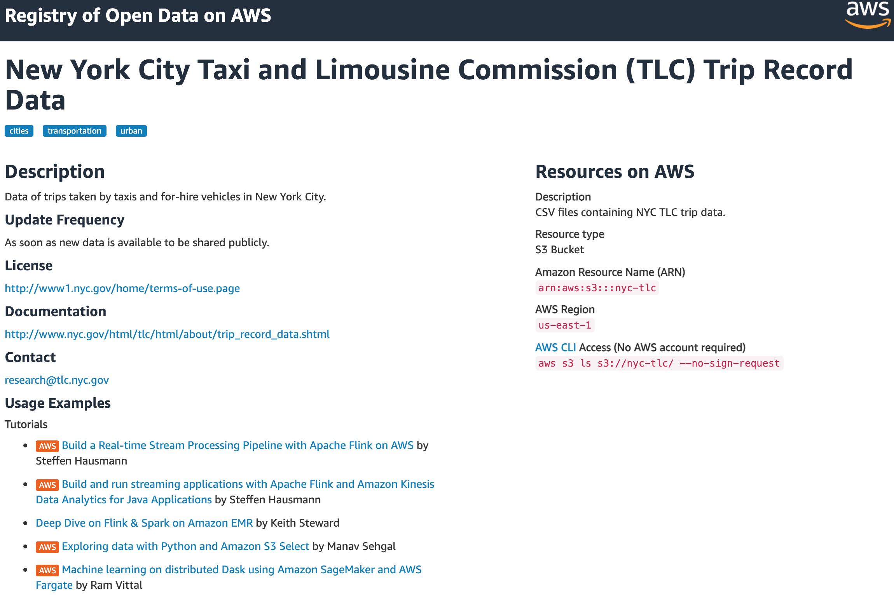
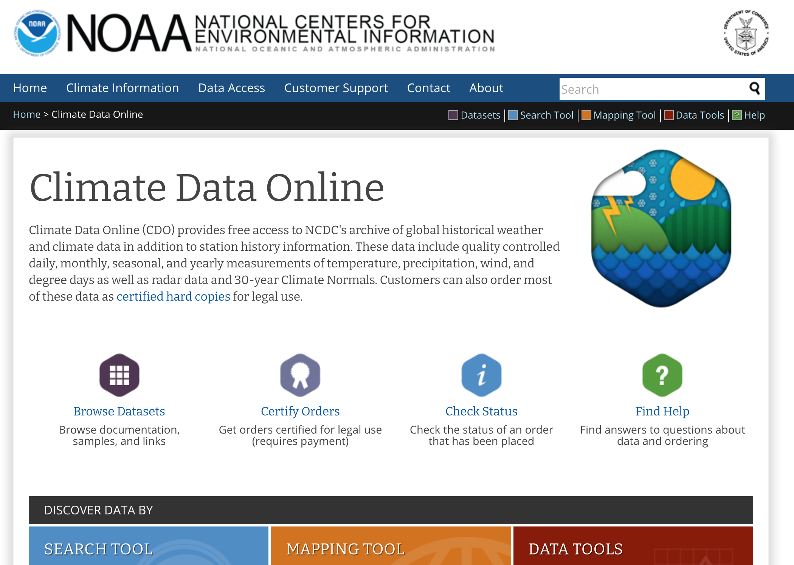
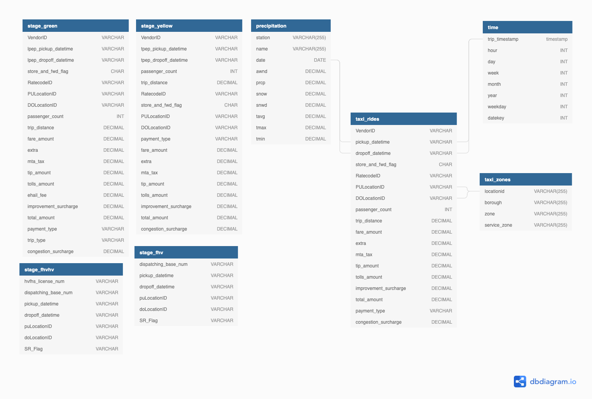
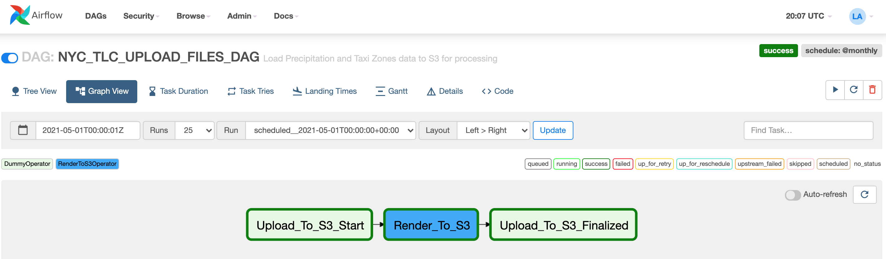
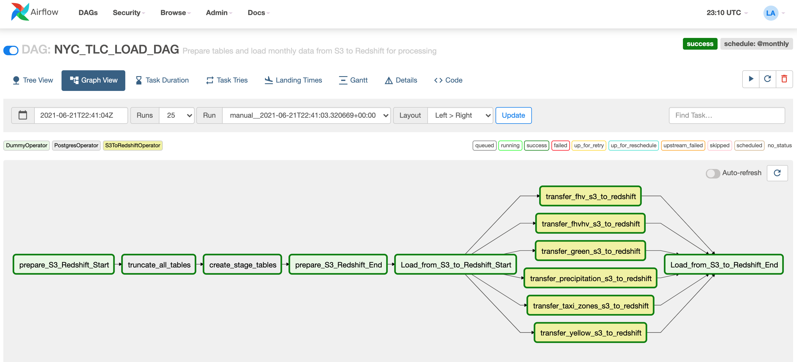
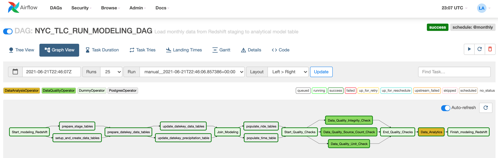
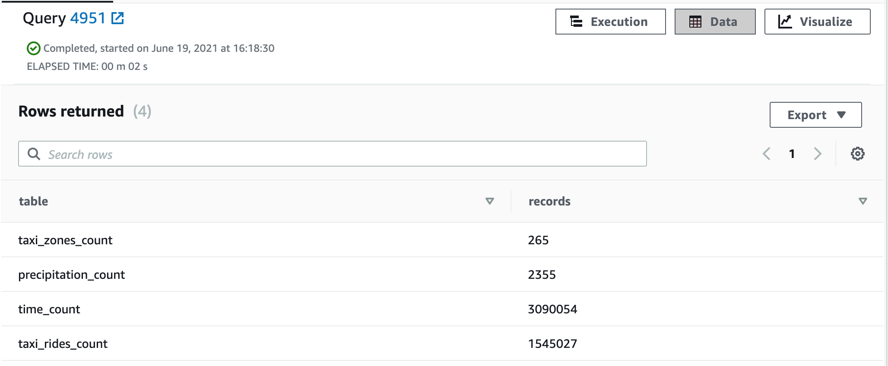

# UDACITY CAPSTONE PROJECT : DATA ENGINEER NANO-DEGREE

## TABLE OF CONTENTS

1. [OBJECTIVE](#objective)
2. [PROJECT](##project)
3. [DATA SOURCES](#data-sources)
4. [DATA MODEL](#data-model)
5. [DATA DICTIONARY](#data-dictionary)
6. [DATA INVESTIGATION](#data-investigation)
7. [STEPS NECESSARY BY THE DAGs](#steps-necessary-by-the-dags)
8. [APACHE AIRFLOW ORCHESTRATION](#apache-airflow-orchestration)
9. [DAG WORKFLOW](#dag-workflow)
10. [HOW TO RUN THIS PROJECT](#how-to-run-this-project)
11. [DATA QUALITY CHECKS](#data-quality-checks)
12. [RESULTS](#results)
13. [SAMPLE QUERY](#sample-query)
14. [SUGGESTIONS FOR THE DATA UPDATE FREQUENCY](#suggestions-for-the-data-update-frequency)
15. [WHAT IF?](#what-if?)
16. [BUILT WITH](#built-with)
17. [AUTHOR](#author)

<!-- OBJECTIVE-->
## OBJECTIVE
The purpose of this project is to build an ETL pipeline that will be able to provide information to data analysts, and researchers about taxi rides and how it can be affected by weather, and to provide a database mechanism that enables queries, joins and analysis in a large volume of trip rides, hapenned in December of 2020. 

The project extracts information from Ney York city taxi and limousine comission (TLC) Trip record dataset offered by AWS, and from NOAA National Oceanic and Atmospheric Administration the weather information.

The datasets are ingested and transformed to an appropriate schema for analytics purposes. This project uses Apache Airflow to automate and orchestrate ETL and data quality tasks on new data as it becomes available on a monthly basis.

AWS Redshift is used because it is fast, with high performance and is horizontally scalable with massive storage capacity. For reference, it takes only 3 minutes in order to move the 15 million rows of the yellow rides from S3 to Redshift.

<!-- PROJECT  -->
## PROJECT
The New York City Taxi and Limousine Commission [(TLC)](https://www1.nyc.gov/site/tlc/about/tlc-trip-record-data.page), created in 1971, is the agency responsible for licensing and regulating New York City's Medallion (Yellow) taxi cabs, for-hire vehicles (community-based liveries, black cars and luxury limousines), commuter vans, and paratransit vehicles. 
The TLC collects trip record information for each taxi and for-hire vehicle trip completed by our licensed drivers and vehicles. They receive taxi trip data from the technology service providers (TSPs) that provide electronic metering in each cab, and FHV trip data from the app, community livery, black car, or luxury limousine company, or base, who dispatched the trip. Over 200,000 TLC licensees complete approximately 1,000,000 trips each day.

Each trip is stored into the dataset as a single row. There are five major data sources that are used, dating from 2009 until present. To see more information, please check this [user guide](https://www1.nyc.gov/assets/tlc/downloads/pdf/trip_record_user_guide.pdf).

<!-- DATA SOURCES -->
## DATA SOURCES



[NYC-TLC](https://registry.opendata.aws/nyc-tlc-trip-records-pds/)



[NOAA Weather Data](https://www.ncdc.noaa.gov/cdo-web/)


### Yellow Taxicabs
Yellow taxicabs are the iconic, yellow vehicles that have the right to pick up street-hailing passengers anywhere in New York City. Taxis can also be dispatched by TLC-licensed E-Hail companies. By law, there are 13,587 taxis in New York City and each taxi must have a medallion affixed to it. Vehicles can be owned by drivers or leased to them by licensed garages. Grant funding is available for wheelchair accessible taxis. The [yellow taxi data dictionary](https://data.cityofnewyork.us/api/views/biws-g3hs/files/eb3ccc47-317f-4b2a-8f49-5a684b0b1ecc?download=true&filename=data_dictionary_trip_records_yellow.pdf) can be downloaded for reference.

### For-Hire Vehicles (FHVs)
For-Hire Vehicles provide pre-arranged service anywhere in New York City and are dispatched by TLC-licensed FHV bases. For-Hire Vehicles must be affiliated with a single FHV base, but may accept dispatches from any base. Currently, the TLC will only accept a new FHV application if the vehicle is wheelchair accessible or is electric, or if the driver has a lease-to-own contract. If you do not have a current FHV license, click “Get a For-Hire Vehicle License” to learn if you are eligible to apply for a new FHV vehicle license. The [FHV data dictionary](https://data.cityofnewyork.us/api/views/am94-epxh/files/0341cc01-520a-49eb-bc3c-94f6c35c6355?download=true&filename=data_dictionary_trip_records_fhv.pdf) and [FHVHV data dictionary](https://www1.nyc.gov/assets/tlc/downloads/pdf/data_dictionary_trip_records_hvfhs.pdf) can be downloaded for reference.

### Green Cabs
Green cabs or Street-Hail Liveries (SHLs) are For-Hire Vehicles that are permitted to accept street-hails. In exchange, Street-Hail Liveries may not operate in the Hail Exclusionary Zone, south of West 110th St and East 96th St. The Street-Hail Livery License is a license that is attached to a For-Hire Vehicle License. Grant funding is available for new wheelchair accessible SHLs. The [green taxi data dictionary](https://data.cityofnewyork.us/api/views/hvrh-b6nb/files/65544d38-ab44-4187-a789-5701b114a754?download=true&filename=data_dictionary_trip_records_green.pdf) can be downloaded for reference.

### Commuter Vans
Commuter vans are vehicles that transport between 9 and 20 passengers in preapproved zones for a flat rate. Commuter vans are operated by Commuter Van Authorities.

### Paratransit Vehicles
Paratransit vehicles provide non-emergency transportation for passengers with disabilities. Paratransit vehicles are dispatched by paratransit bases.


<!-- DATA MODEL -->
## DATA MODEL

The Star Database Schema (Fact and Dimension Schema) is used for data modeling in this ETL pipeline. There is one fact table containing all the metrics (facts) associated to each tweet and five dimensions tables, containing associated information such as user, source etc. This model enables to search the database schema with the minimum number of *SQL JOIN*s possible and enable fast read queries. 



Using this data model, we can finally answer questions regarding relationships between taxi rides, location and variance accordingly to the weather and precipitation in New York City.


<!-- DATA DICTIONARY -->
## DATA DICTIONARY
The data dictionary [DATADICT](DATADICT.md) contains a description of every attribute for all tables listed above.


<!-- DATA INVESTIGATION -->
## DATA INVESTIGATION

Due to the large data size, I'm using only the data from December 2020. Data for each taxi type is stored in a CSV file for each month in the 'trip data' folder. Information about the different taxi zones and borough maps are located in the 'misc' folder. A duplicate taxi zones table was uploaded to a public S3 bucket in JSON format with a representative manifest file for reading it into Redshift.
A dataset containing weather information since 2015 and onward from a weather station located at the Central Park stored into a S3 folder as a JSON file. 
All that was done to meet the project specifications of multiple data source formats.

The data required for this project is of very high quality, however minor cleaning needed to be done while reading data from S3 to Redshift. The trip data needed to be modified during the load step by including the following code in the query: delimiter ',' IGNOREBLANKLINES REMOVEQUOTES EMPTYASNULL. Secondly, a manifest file needed to be created to mediate loading of the taxi zones data and a second manifest file was needed to mediate the weather loading.

<!-- STEPS NECESSARY BY THE DAGs -->
## STEPS NECESSARY BY THE DAGs

- Staging tables are created using the PostgresOperator
- A configured S3ToRedshiftOperator is used to move taxi zone data (JSON), weather precipitation data (JSON), and ride data (CSV) from S3 to redshift.
- The first DataQualityOperator is used to validate that data had been populated into the staging tables.
- The PostgresOperator is again used to create the final data model, create the dimensions and fact tables,  and edit the staging tables structure in preparation for merging.
- The PostgresOperator is used to copy data from the staging tables to the taxi_rides (fact) table, create the precipitation and time dimensions table.
- The second DataQualityOperator is used to check that the final tables had been populated as expected.
- The DataAnalysisOperator is used to run simple analytical queries on the data model to validate the model.
- The data model allows ad hoc queries regarding the number and total income of each borough for taxis and is joined to avoid having to join the green and yellow taxi data at run time and weather. 
- And finally, the model also included staging tables for fhv and fhvhv rides which can be queried to determine the number of rides per ride type per borough.

<!-- APACHE AIRFLOW ORCHESTRATION -->
## APACHE AIRFLOW ORCHESTRATION

### DAG STRUCTURE

The DAG parameters are set according to the following :

- The DAG does not have dependencies on past runs
- DAG has schedule interval set to daily
- On failure, the task are retried 3 times
- Retries happen every 5 minutes
- Catchup is turned off
- Email are not sent on retry

<!-- DAG WORKFLOW -->
## DAG WORKFLOW

### DAG #1 : NYC_TLC_UPLOAD_FILES_DAG


### DAG #2 : NYC_TLC_LOAD_DAG


### DAG #3 : NYC_TLC_RUN_MODELING_DAG


<!-- HOW TO RUN THIS PROJECT -->
## HOW TO RUN THIS PROJECT

1. Clone this project from [Github](https://github.com/LeoArruda/UdacityCapstoneDataEngineer)
2. Create an user on AWS
3. Create an IAM role on AWS
    * Attach the *AmazonS3ReadOnlyAccess* policy.
4. Create a security group in the Amazon EC2 console with the following values:
    * Type: *Custom TCP Rule*
    * Protocol: *TCP*
    * Port Range: *5439*
    * Source: select *Custom IP*, then type *0.0.0.0/0*
5. Launch a redshift cluster using the *IAM role* and *security group* you defined previously.
    * For this project, the recommended configuration is *dc2.large* cluster.
    * CPU: 8 EC2 compute units (2 virtual cores) per node
    * Memory: 15.25 GiB per node
    * Storage: 160-320 GB SSD per node
    * Cluster type: Single node   
6. Create an *IAM user* to allow you to issue commands to both Redshift and S3
    * Assign *programmatic access* with the following policies:
        * *AmazonRedshiftFullAccess*
        * *AmazonS3ReadOnlyAccess*
    * **Save your credentials** because it is only accessible at creation.
7. Install Apache-Airflow and dependencies (requirements.txt)
    * Run: pip install -r requirements.txt
    * Run airflow:
        * airflow init
        * To start, I created the bash script: **start.sh**
        * If you prefer to run manually:
            * airflow scheduler
            * airflow webserver
    * On Airflow console, you must create the following *connections*:
        * *redshift*: a postgres connection with your cluster information, user and password.
        * *aws_credentials*: an Amazon connection with your IAM user key.
8. An S3 bucket "udacity-data-lake" need to be created as of (18 June 2021) with the 'data/taxi_zones.json' file and 'data/taxi_paths.json' manifest. You also need to copy the 'data/precipitation.json' file and 'data/precipitation_paths.json' manifest. 

<!-- DATA QUALITY CHECKS -->
## DATA QUALITY CHECKS

* Integrity checks

  The relational database has integrity checks in place with the use of PRIMARY KEYs in fact and dimensional tables. These keys ensure that these values are UNIQUE and NOT NULL. The tables for Happiness Index and Temperature data have NOT NULL constraints for their entries - since we have already explored them and made sure that they are not NULL. The LOCATION attribute in the tweets table has the NOT NULL constraint since we intend to use that field for analytics. We cannot be stringent about the NULL values in other attributes of the tweets table since the data is dynamic and may have missing values in fields we do not require in this project.

* Source/Count checks

  Source count checks have been implemented in the Airflow DAGs using the CheckOperator and ValueCheckOperator. Since we already know the number of entries in the static datasets we could use the ValueCheckOperator to check all the entries have been inserted. Since we don't know the entries for dynamic tweet data we could use the CheckOperator to check any entries have been made to the table.

* Unit checks

  Unit tests to validate that some unit of the software code performs as expected. I'm testing some calculations are producing the expected results.


### TOOLS AND TECHNOLOGIES USED

* [Python](https://www.python.org/)

* [Apache Airflow](https://airflow.apache.org/) 

  Apache Airflow is an open-source tool for orchestrating complex computational workflows and data processing pipelines. It is a platform to programmatically author, schedule, and monitor workflows. When workflows are defined as code, they become more maintainable, versionable, testable, and collaborative. We use Airflow to author workflows as directed acyclic graphs (DAGs) of tasks. The Airflow scheduler executes your tasks on an array of workers while following the specified dependencies. Rich command line utilities make performing complex surgeries on DAGs a snap. The rich user interface makes it easy to visualize pipelines running in production, monitor progress, and troubleshoot issues when needed.

* [Amazon Web Services](https://aws.amazon.com/)

  * [AWS S3](https://aws.amazon.com/s3/)

    Amazon Simple Storage Service (Amazon S3) is an object storage service that offers industry-leading scalability, data availability, security, and performance. This means that we can use it to store and protect any amount of data for a range of use cases, such as big data analytics. Amazon S3 is designed for high of durability, and stores data for millions of applications for companies all around the world. In this project, we use this tool to store our static and dynamic datasets - acting as a data lake for our data. 

  * [AWS Redshift](https://aws.amazon.com/redshift/)

    Amazon Redshift is the most popular and fastest cloud data warehouse. Redshift is a fully-managed petabyte-scale cloud based data warehouse product designed for large scale data set storage and analysis. It is also used to perform large scale database migrations. Redshift’s column-oriented database is designed to connect to SQL-based clients and business intelligence tools, making data available to users in real time. In this project, we use this tool to warehouse our data so that we could easily scale it when necessary. 


<!-- RESULTS -->
## RESULTS

- Querying the number of records


<!-- SAMPLE -->
## SAMPLE QUERY

The following query is a sample of the analytical analysis used to retrieve the number of taxi trips, when pickup location was Newark Airport, happened during the 50th week of 2020. The query also returns temperature and the precipitation level.

```
{
  SELECT count(*) as trips, TR.vendorid, TZ.zone, TI.day, TI.month, TI.year, PR.prcp, PR.tmax, PR.tmin 
  FROM taxi_rides as TR
  JOIN taxi_zones as TZ 
    ON TR.pulocationid = TZ.locationid
  JOIN time as TI
    ON TR.pickup_datetime = TI.trip_timestamp
  JOIN precipitation as PR
      ON TI.datekey = PR.datekey
  WHERE pulocationid = 1
  AND TI.week = 50
  GROUP BY TR.vendorid, TZ.zone, TI.day, TI.month, TI.year, PR.prcp, PR.tmax, PR.tmin;
}
```

The result expected is:

| trips | vendorid | zone | day | month | year | prcp | tmax | tmin |
| ----- | -------- | --------------- | -- | ----- | ---- | ---- | ---- | ---- |
| 2	| 2	| Newark Airport	| 8	| 12	| 2020	| 0	| 36	| 30 |
| 1	| 1	| Newark Airport	| 10	| 12	| 2020	| 0	| 49	| 36 |
| 2	| 2	| Newark Airport	| 11	| 12	| 2020	| 0	| 57	| 39 |
| 1	| 2	| Newark Airport	| 7	| 12	| 2020	| 0	| 40	| 32 |
| 1	| 2	| Newark Airport	| 10	| 12	| 2020	| 0	| 49	| 36 |
| 2	| 1	| Newark Airport	| 13	| 12	| 2020	| 0	| 62	| 47 |
| 2	| 1	| Newark Airport	| 11	| 12	| 2020	| 0	| 57	| 39 |
| 1	| 2	| Newark Airport	| 12	| 12	| 2020	| 0	| 58	| 46 |


<!-- SUGGESTIONS -->
## SUGGESTIONS FOR THE DATA UPDATE FREQUENCY
The data should be updated daily if possible, so that the star schema tables are always updated with the most recent data for a more accurate analysis. 


<!-- WHAT IF -->
## WHAT IF?

This section discusses strategies to deal with the following three key scenarios:

1. Data is increased 100x. 
2. Data pipeline is run on daily basis by 7 am every day.
3. Database needs to be accessed by 100+ users simultaneously.

### 1. Data is increased 100x

In this project we have used scalable, fully managed cloud services to store and process our data throughout. As mentioned earlier, we can easily scale our resources vertically or horizontally with few clicks to tackle this scenario. Increased resources for AWS Redshift would allow us to load larger static datasets faster. For the increased volume of streaming tweet data, we could either upload the tweets in batches rather than individually or use multiple AWS Kinesis delivery streams to ingest data parallely.

### 2. Data pipeline is run on a daily basis by 7 am every day

As the static datasets do not change on a daily basis, the major challenge here is to process the a day's amount of captured tweets in an acceptable time. AWS Kinesis stores the data in AWS S3 partitioned by yearly/monthly/daily/hourly blocks. This makes it easy to run tasks in parallel DAGs with reduced data volume. Hence, the entire data could be processed within the stipulated time.

### 3. Database needs to be accessed by 100+ users simultaneously

We are using cloud based services, which can be easily given access to the 100+ users. To improve the performance, we need more CPU resources with increased user count. Using a distributed database, we can to improve oour replications and partitioning to get faster query results for each user. If a group of users work on a specific subset of data or have an expensive query, we can also explore creating duplicate tables for them (if possible). 


<!-- BUILT WITH -->
## BUILT WITH
- Python 3.6, and Airflow 2.0.2


<!-- AUTHOR -->
## AUTHOR
- Leo Arruda - [Github Profile](https://github.com/LeoArruda/)